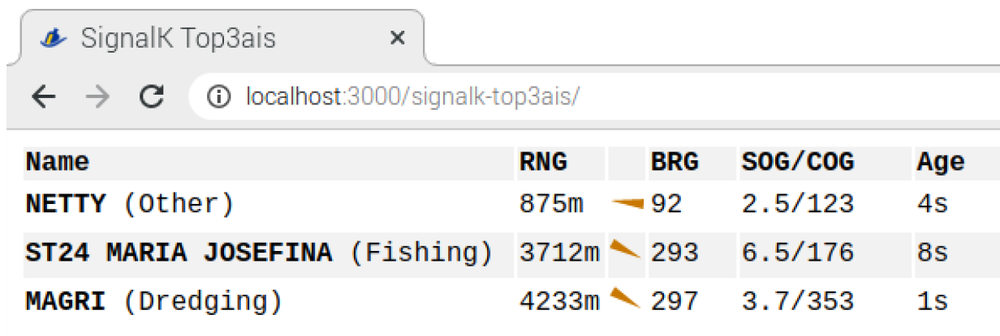

# signalk-browser

One-file tool that presents the 'self' data from a local SignalK engine. It converts units to nautical units, and it updates automatically. Multiple formats are possible: all data, a selection of operational data for display in a smart device, or a simple wind gauge for apparent and true wind.

Usage
- When installed as an NPM package within SignalK, install the package and restart the server. The Package will show up under Webapps.
- For standalone usage, in the file index.html, adjust the variable mySignalkURL to reflect the IP of your SignalK server. The default is right for a typical Openplotter installation.
```
//
// Configure your signalk url:port below, like openplotter.myboat.local:3000 or 10.10.10.1:3000
//
var mySignalkURL = "10.10.10.1:3000"

```

Then, open the file in your browser. With ?presentation=table, it shows all 'paths' from all sources in signalk. It strikes out paths that are stale (by default 5 seconds or older). Note that when there are multiple paths and the SignalK Source Priorities have been set, the lower priority paths are staled out here.



With ?presentation=gauge, it shows a wind gauge with apparent and true wind, if available. Also, it features an aviation-style 'heading bug', that points to the next waypoint, and distance and VMG, if an active route is provided:


With ?presentation=display, it shows a selection of values in a way that does well on mobile devices:


With ?presentation=both, it shows both wind gauge and information display, oriented according to the device orientation. This is actually the default presentation format, when no preference is given.

With ?presentation=battery, it shows a battery panel, showing data from a ve.direct victron interface (see https://github.com/marcobergman/SensESP/tree/master/examples/ve.direct_mppt)

